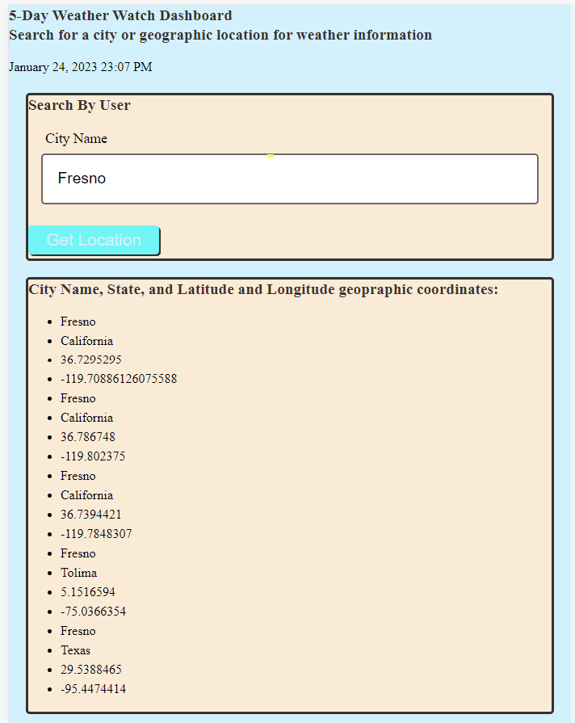

# 5-Day Weather Watch Dashboard

## Description

My motivation was to build a dashboard that will display the 5-day weather outlook for multiple cities so that a potential traveler could plan a trip and activities with the weather taken into consideration.

## Installation

An internet browser such Microsoft Edge, Chrome, Firefox, and Google will need to be installed for the Work Day Schedule.

## Usage

User types a City Name into Form and Submit City Name
Then City matching name from a maximum of 5 different states, countries will be identified and displayed under City Name, State, and Latitude and Longitude geographic coordinates.
Then the Longitude and Latitude will be called into API for weather data
The weather data will display under the 5 Day Weather forecast by location.

## Credits

Weather source: https://openweathermap.org/forecast5

## License

MIT License
